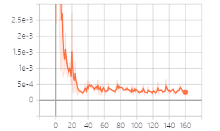

# simple_keypoints

目录
[TOC]


**`2022-07`**

---

# 0.文件下载
环境及代码：
链接：https://pan.baidu.com/s/1qWqdBhbOJZ3x-JQM0M-img 
提取码：l8af 


---

# 1.不能联网主机环境搭建
##1.1  查找本机conda环境下的路径

win+r 打开运行窗口，输入``cmd``,打开命令行窗口，输入
```
conda info --envs
```

找到envs 文件夹所在目录

## 1.2 复制文件

1. 将mmd文件夹全部复制到envs文件夹下

2. 将pkgs文件夹替换掉原有的pkgs

## 1.3 激活当前环境
```
activate mmd
```

# 2.  数据集

## 2.1 处理为标准格式

首先切换到代码所在目录
```
cd keypoints
```

默认数据集格式为：每一列分别对应目标的类型、 关键点的x坐标和y坐标
|    0     |   1   |    2 |
| :------: | :---: | ---: |
| 目标类型 |   x   |    y |

运行
参数说明：
--images: 图像路径，默认标签文件和图像同路径
--annotations: 生成的标签文件名称


···
python convertDatasets.py --images ./images --annotations train_test.txt
···

生成标准数据集格式，打开txt文件如下：
|    0     |   1   |    2 |    3 |
| :------: | :---: | ---: | ---: |
| 图像路径 | 类别  |    X |    Y |

## 2.2 划分训练集与测试集

--annotations：标签文件的全路径
--frequence: 训练集与测试集的比例

```
python random_shuffle.py --annotations train_test.txt --frequence 10

```

---

运行后会在当前路径下生成``train.txt`` 和``test.txt``

# 3.开始训练
 --epochs : 训练步数
 --batchsize： 批处理大小
 --data_path： 训练集路径


```python
python train.py --epochs 300 --batchsize 8 --data_path train.txt 
```

# 4. 查看训练中的loss曲线

```

tensorboard --logdir='experiment\plane'
```



# 5.训练好的网络进行预测
```
python predict.py --anno train.txt --weights experiment/plane/final_state.pth.tar --result  result

```

> :joy:
